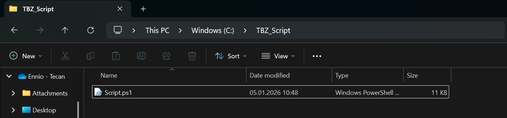
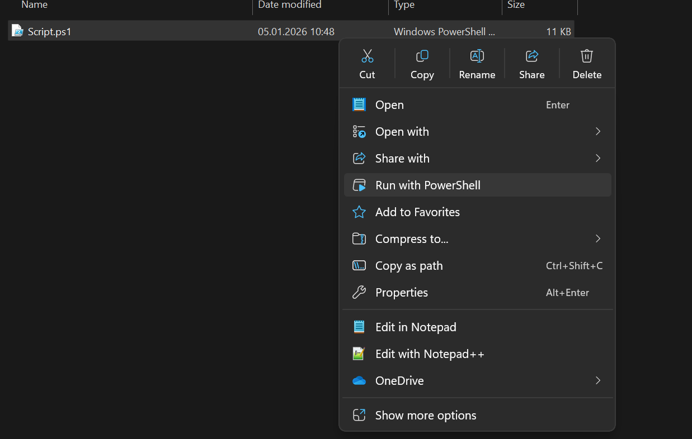

# M122 Script Sofia & Ennio
[Da bitt erkläre was euses Script macht]

## Anleitung

1. Das Script sollte in dem Ordner gespeichert werden wo man die Rezepte oder den Mealplan speichern möchte:

2. Wenn man nur ein Rezept braucht, oder sich einen Mealplan erstellen möchte kann man das Script einfach ausführen:

3.