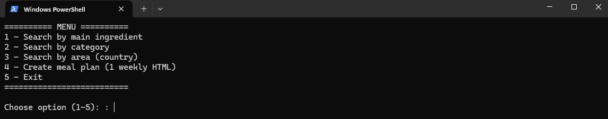
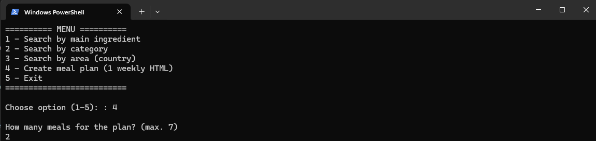
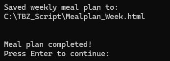
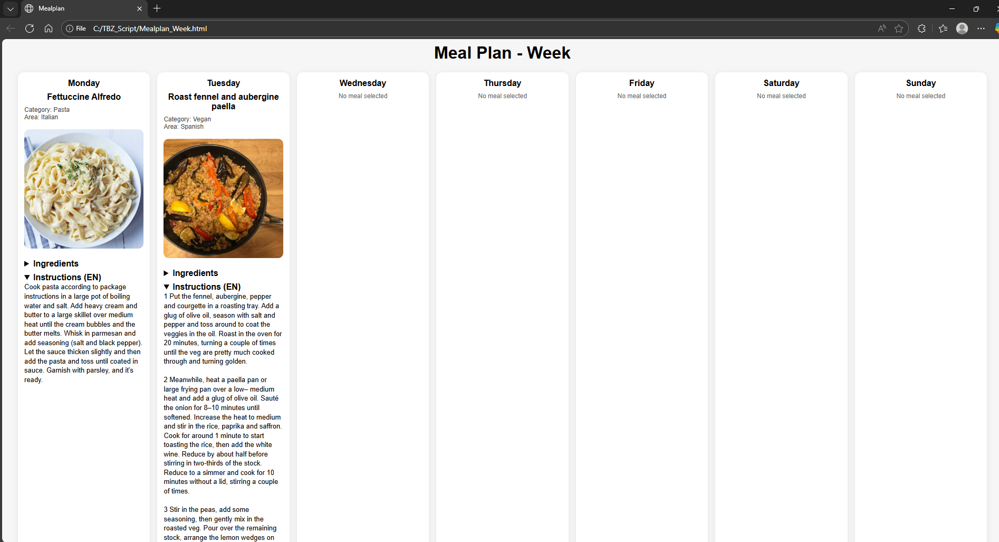

# M122 Script Sofia & Ennio
Unser Script ist dazu da um Rezepte zu finden und Mealpläne zu erstellen.

## Code Erklärung 

1. Funktion: Rezeptdetails abrufen

function Get-MealDetails($id) {
    $url = "https://www.themealdb.com/api/json/v1/1/lookup.php?i=$id"
    $response = Invoke-RestMethod -Uri $url
}

#### 🔹 Zweck der Funktion

- Ruft Detailinformationen eines Rezepts über dessen ID ab

- Nutzt Invoke-RestMethod, um JSON-Daten von der API zu laden

- Gibt vollständige Infos zu Zutaten, Anleitung & Kategorie zurück

------

2. Funktion: Zutaten & Mengen anzeigen

    for ($i = 1; $i -le 20; $i++) {
        $ingredient = $meal."strIngredient$i"
        $measure = $meal."strMeasure$i"
    }

#### 🔹 Erklärung
- Die API speichert Zutaten nummeriert (strIngredient1 bis strIngredient20)

- Die Schleife geht alle möglichen Zutaten durch

- Nur nicht-leere Zutaten werden ausgegeben
----
3. Rezeptsuche über Benutzereingabe

$search = Read-Host "Bitte Gericht eingeben"
$url = "https://www.themealdb.com/api/json/v1/1/search.php?s=$search"
$response = Invoke-RestMethod -Uri $url

#### 🔹 Was passiert hier?

- Benutzer gibt einen Suchbegriff ein

- API wird mit diesem Begriff abgefragt

- Passende Rezepte werden geladen
---
6. Anzeige der Suchergebnisse

for ($i = 0; $i -lt $meals.Count; $i++) {
    Write-Host "$($i+1): $($meals[$i].strMeal)"
}

#### 🔹 Funktion

- Listet alle gefundenen Rezepte nummeriert auf

- Ermöglicht dem Benutzer eine einfache Auswahl
---
7. Auswahl & Detailanzeige

$choice = Read-Host "Nummer auswählen"
Get-MealDetails $meals[$choice-1].idMeal

#### 🔹 Ablauf

- Benutzer wählt ein Rezept per Nummer

- Die passende Rezept-ID wird an Get-MealDetails übergeben

- Details werden angezeigt

## Anleitung

1. Das Script sollte in dem Ordner gespeichert werden wo man die Rezepte oder den Mealplan speichern möchte:

2. Wenn man nur ein Rezept braucht, oder sich einen Mealplan erstellen möchte kann man das Script einfach ausführen:

3. Wenn das Script läuft, kann man zwischen den verschiedenen Optionen auswählen: 

4. Die Optionen sind ziemlich selbsterklärend, aber als Beispiel zeigen wir, wie man einen Mealplan erstellt. Dafür muss man die 4. Option auswählen und angeben wieviele Rezepte man möchte wie hier im Bild: 

5. Danach muss man für jedes Rezept angeben nach welche Kategorie man beim API filtern möchte und danach ein passendes Gericht auswählen:

Dies muss man dann für jedes Gericht wiederholen, bis man sich für alle entschieden hat.

6. Am Schluss generiert es den Mealplan als HTML-File im Ordner

Welcher dann so Aussieht:

